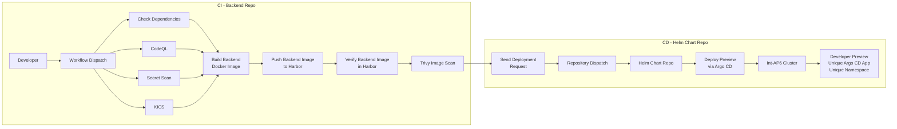

# Backend Repository – Developer Preview CI/CD



---


## Purpose

The Backend repository builds and validates the backend Docker image.

It **does not deploy directly**.

After the image passes all quality and security checks, it sends a deployment request to the Helm Chart repository.

---

## Deployment Configuration

| Item        | Value                                                              |
| ----------- | ------------------------------------------------------------------ |
| Deployment  | Developer Preview                                                  |
| Trigger     | Manual (GitHub Actions)                                            |
| Branches    | `feature/*`, `bugfix/*`, `hotfix/*`, `chore/*`, `feat/*`, `docs/*` |
| Cluster     | Int-AP6 Cluster                                                    |
| Values File | `values-dev.yaml`                                                  |
| Purpose     | Individual developer preview                                       |

---

## GitHub Actions Workflow

1. Check Dependencies
2. CodeQL
3. Secret Scan
4. KICS
5. Build Backend Docker Image
6. Verify Backend Image in Harbor Registry
7. Scan Backend Image with Trivy
8. Send Deployment Request to Helm Repository

---

## Output

```
Backend Source Code

↓

Docker Image

↓

Harbor Registry

↓

Repository Dispatch

↓

Helm Chart Repository
```