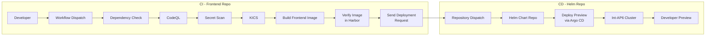

# Frontend Repository – Developer Preview CI/CD


---

## Purpose

The Frontend repository is responsible for building and validating the frontend Docker image.

It **does not deploy directly to Kubernetes**.

Instead, after the Docker image has been successfully built and verified, it sends a **Repository Dispatch** event to the Helm Chart repository, which performs the deployment.

---

## Deployment Configuration

| Item        | Value                                                              |
| ----------- | ------------------------------------------------------------------ |
| Deployment  | Developer Preview                                                  |
| Trigger     | Manual (GitHub Actions)                                            |
| Branches    | `feature/*`, `bugfix/*`, `hotfix/*`, `chore/*`, `feat/*`, `docs/*` |
| Cluster     | Int-AP6 Cluster                                                    |
| Values File | `values-dev.yaml`                                                  |
| Purpose     | Individual developer preview                                       |

---

## GitHub Actions Workflow

The workflow performs the following steps.

1. Check Dependencies
2. CodeQL
3. Secret Scan
4. KICS
5. Build Frontend Docker Image
6. Verify Frontend Image in Harbor Registry
7. Scan Frontend Image with Trivy
8. Send Deployment Request to Helm Repository

---

## Output

```
Frontend Source Code

↓

Docker Image

↓

Harbor Registry

↓

Repository Dispatch

↓

Helm Chart Repository
```

