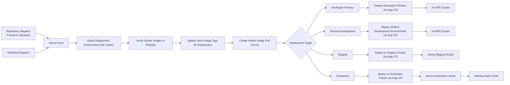
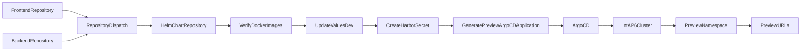
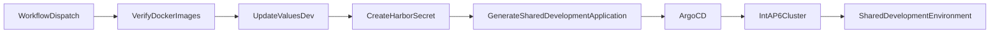
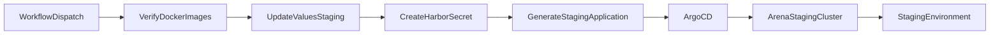
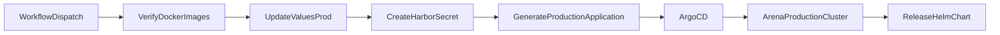

# Helm Chart Repository – Deployment Pipeline

---

# Purpose

The Helm Chart repository is responsible for deploying existing Docker images into Kubernetes clusters using **Helm** and **Argo CD**.

Unlike the Frontend and Backend repositories, it **does not build Docker images**.

Its responsibilities include:

- Verify Docker images already exist in Harbor.
- Update Helm image tags.
- Create the Harbor image pull secret.
- Generate Argo CD Applications.
- Deploy applications to Kubernetes.
- Release the Helm Chart for production deployments.

---

# Supported Deployments

| Deployment | Branch | Trigger | Cluster | Values File | Purpose |
|------------|---------|----------|---------|-------------|---------|
| **Developer Preview** | `feature/*`, `bugfix/*`, `hotfix/*`, `feat/*`, `chore/*`, `docs/*` | Repository Dispatch / Manual | **Int-AP6 Cluster** | `values-dev.yaml` | Individual developer testing with an isolated Argo CD application and namespace. |
| **Shared Development** | `develop` | Manual | **Int-AP6 Cluster** | `values-dev.yaml` | Shared environment for QA, integration testing and test automation. |
| **Staging** | `develop` | Manual | **Arena Staging Cluster** | `values-staging.yaml` | Validate application changes before production deployment. |
| **Production** | `release/*` | Manual | **Arena Production Cluster** | `values-prod.yaml` | Deploy release version to the production environment. |

---

# Developer Preview Deployment

Developer Preview deployments are automatically requested by the Frontend or Backend repositories after a successful Docker image build.

### Result

Each developer receives:

- Unique Argo CD Application
- Unique Kubernetes Namespace
- Unique Helm Release
- Frontend URL
- Backend URL
- TLS Certificate
- Independent Preview Environment

---

# Shared Development Deployment

After code has been merged into the **develop** branch, the Helm repository deploys the shared development environment.

### Result

Shared Development provides:

- Shared environment for all developers
- QA testing
- Integration testing
- Automated testing
- Stable development environment

---

# Staging Deployment

Staging deployments use the existing Docker images from Harbor together with the staging Helm configuration.

### Result

The staging environment is used for:

- Release validation
- User acceptance testing
- Final integration testing
- Production verification

---

# Production Deployment

Production deployments use the release branch and production Helm configuration.

### Result

Production deployment includes:

- Production Kubernetes deployment
- Production ingress
- Production TLS
- Helm Chart Release
- Production-ready application

---

# Complete CI/CD Overview

```mermaid
flowchart LR

Developer

--> FrontendRepository

Developer

--> BackendRepository

FrontendRepository

--> CheckDependencies

--> CodeQL

--> SecretScan

--> KICS

--> CreateFrontendDockerImageTag

--> BuildFrontendDockerImage

--> VerifyFrontendImageInHarborRegistry

--> ScanFrontendImageWithTrivy

--> RepositoryDispatch

BackendRepository

--> CheckDependencies2

--> CodeQL2

--> SecretScan2

--> KICS2

--> CreateBackendDockerImageTag

--> BuildBackendDockerImage

--> VerifyBackendImageInHarborRegistry

--> ScanBackendImageWithTrivy

--> RepositoryDispatch

RepositoryDispatch

--> HelmChartRepository

HelmChartRepository

--> SecretScanHelm

--> SelectDeploymentEnvironmentAndCluster

--> VerifyDockerImagesInRegistry

--> UpdateHelmImageTagsForDeployment

--> CreateHarborImagePullSecret

--> DeployDeveloperPreviewViaArgoCD

--> DeploySharedDevelopmentEnvironmentViaArgoCD

--> DeployToStagingClusterViaArgoCD

--> DeployToProductionClusterViaArgoCD

--> ReleaseHelmChart
```

---

# Deployment Summary

| Deployment | Trigger | Source | Cluster | Values File |
|------------|----------|---------|---------|-------------|
| Developer Preview | Repository Dispatch | Frontend / Backend | Int-AP6 | values-dev.yaml |
| Shared Development | Manual Workflow Dispatch | Helm Repository | Int-AP6 | values-dev.yaml |
| Staging | Manual Workflow Dispatch | Helm Repository | Arena Staging | values-staging.yaml |
| Production | Manual Workflow Dispatch | Helm Repository | Arena Production | values-prod.yaml |

---

# Key Responsibilities

## Frontend Repository

- Build frontend Docker image
- Push image to Harbor
- Verify image
- Scan image with Trivy
- Send deployment request

---

## Backend Repository

- Build backend Docker image
- Push image to Harbor
- Verify image
- Scan image with Trivy
- Send deployment request

---

## Helm Chart Repository

- Verify Docker images exist
- Update Helm image tags
- Create Harbor registry secret
- Generate Argo CD Applications
- Deploy to Kubernetes
- Release Helm Chart (Production only)

