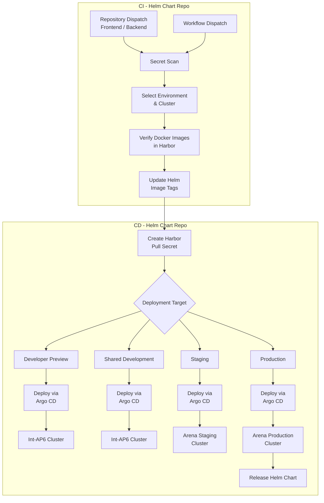
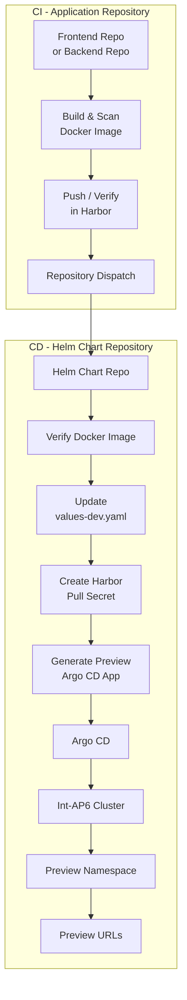
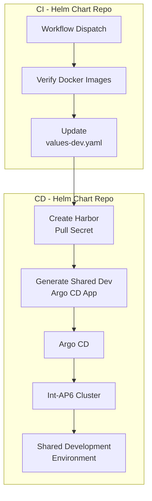
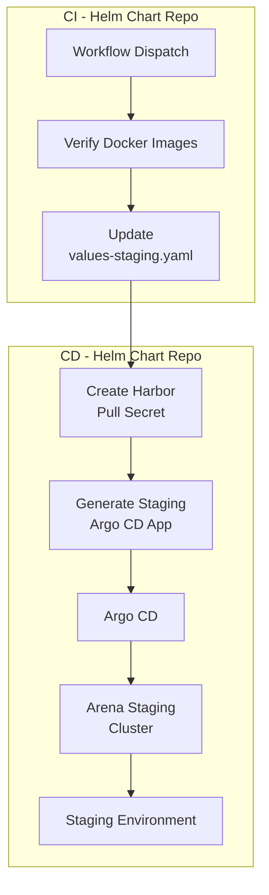
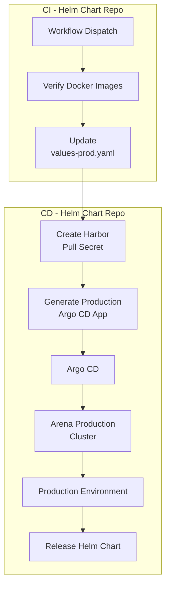
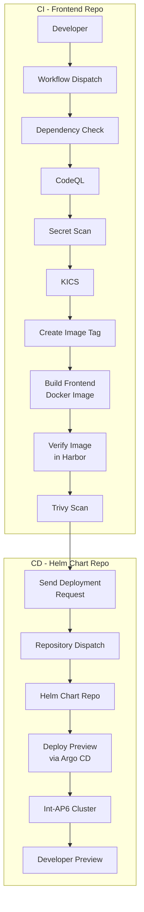
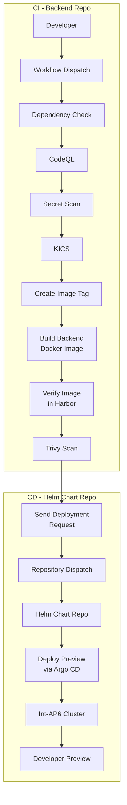
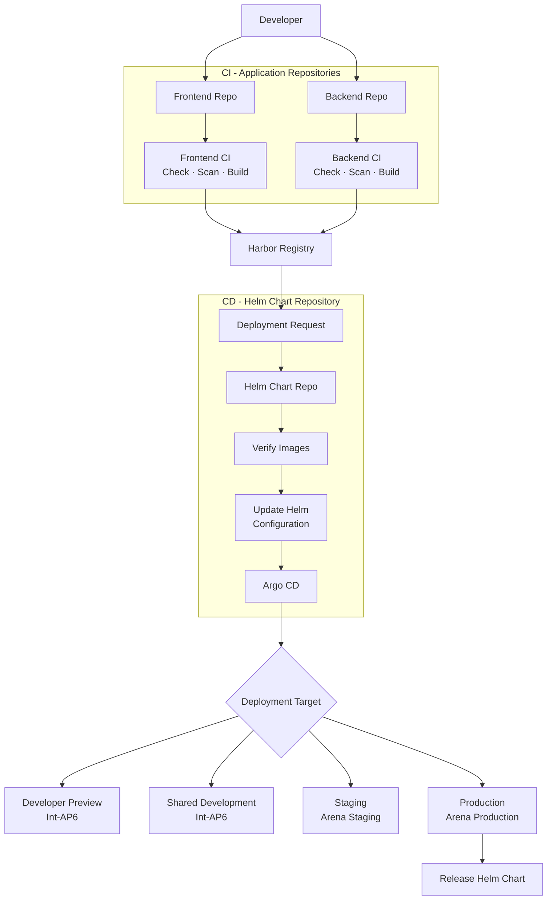

# Helm Chart Repository – Deployment Pipeline

This document describes the SDE Helm Chart repository deployment pipeline, supported environments, CI/CD responsibilities, and integration with the Frontend and Backend repositories.

---

# CI/CD Pipeline

---

# Purpose

The Helm Chart repository is responsible for deploying existing Docker images into Kubernetes clusters using **Helm** and **Argo CD**.

Unlike the Frontend and Backend repositories, it **does not build application Docker images**.

Its responsibilities include:

- Receive Developer Preview deployment requests from the Frontend and Backend repositories.
- Support manual deployments using GitHub Actions Workflow Dispatch.
- Run repository security checks.
- Select the target deployment environment and Kubernetes cluster.
- Verify that the requested Frontend and Backend Docker images exist in Harbor.
- Update Helm image tags for deployment.
- Create the Harbor image pull secret in the target namespace.
- Generate Argo CD Applications.
- Deploy applications to Kubernetes through Argo CD.
- Support Developer Preview, Shared Development, Staging, and Production.
- Release the Helm Chart for Production deployments.

---

# Supported Deployments

| Deployment | Branch | Trigger | Cluster | Values File | Purpose |
|---|---|---|---|---|---|
| **Developer Preview** | `feature/*`, `bugfix/*`, `hotfix/*`, `feat/*`, `chore/*`, `docs/*` | Repository Dispatch / Manual | **Int-AP6 Cluster** | `values-dev.yaml` | Individual developer testing with an isolated Argo CD Application and namespace. |
| **Shared Development** | `develop` | Manual | **Int-AP6 Cluster** | `values-dev.yaml` | Shared environment for QA, integration testing, and test automation. |
| **Staging** | `develop` | Manual | **Arena Staging Cluster** | `values-staging.yaml` | Validate application changes before Production deployment. |
| **Production** | `release/*` | Manual | **Arena Production Cluster** | `values-prod.yaml` | Deploy the release version to the Production environment. |

---

# Developer Preview Deployment

Developer Preview is designed for individual developer testing.

The Frontend or Backend repository first performs its CI pipeline.

After the Docker image has been successfully built, verified in Harbor, and scanned with Trivy, the application repository sends a deployment request to the Helm Chart repository.

The Helm Chart repository then handles the deployment.

## Developer Preview Result

Each Developer Preview receives:

- A unique Argo CD Application.
- A unique Kubernetes namespace.
- A unique Helm release.
- An isolated Frontend deployment.
- An isolated Backend deployment.
- A unique Frontend URL.
- A unique Backend URL.
- TLS configuration.
- An independent environment for developer testing.

This allows developers to test their changes independently without affecting the Shared Development environment or another developer's preview.

---

# Shared Development Deployment

Shared Development provides a common environment for QA, integration testing, and test automation.

The deployment is started manually from the Helm Chart repository using GitHub Actions Workflow Dispatch.

Existing Frontend and Backend Docker image tags from Harbor are selected for deployment.

## Shared Development Result

Shared Development provides:

- A shared environment for developers.
- QA testing.
- Integration testing.
- Automated testing.
- Validation of merged application changes.
- Deployment to the Int-AP6 cluster.
- Configuration from `values-dev.yaml`.

---

# Staging Deployment

Staging is used to validate the application before Production.

The deployment is started manually from the Helm Chart repository.

Existing Frontend and Backend Docker image tags are selected from Harbor and deployed using the staging-specific configuration.

## Staging Result

The Staging environment is used for:

- Release validation.
- User acceptance testing.
- Final integration testing.
- Environment-specific validation.
- Verification before Production deployment.

---

# Production Deployment

Production deployment uses a `release/*` branch and the Production Helm configuration.

The deployment is started manually from the Helm Chart repository.

Existing and validated Frontend and Backend Docker image tags are selected for Production deployment.

## Production Result

Production deployment includes:

- Deployment to the Arena Production Kubernetes cluster.
- Production Helm configuration.
- Production ingress.
- Production TLS.
- Production Frontend and Backend images.
- Argo CD managed deployment.
- Helm Chart release.

---

# Frontend Repository – CI/CD Flow

The Frontend repository is responsible for **Frontend CI**.

The detailed CI pipeline runs in the Frontend repository. After CI succeeds, the deployment responsibility moves to the Helm Chart repository.

## Frontend Responsibilities

- Run dependency checks.
- Run CodeQL.
- Run Secret Scan.
- Run KICS.
- Resolve the Frontend Docker image tag.
- Build the Frontend Docker image.
- Push the image to Harbor.
- Verify the image exists in Harbor.
- Scan the image with Trivy.
- Send a Developer Preview deployment request to the Helm Chart repository.

The Frontend repository **does not directly deploy the application to Kubernetes**.

---

# Backend Repository – CI/CD Flow

The Backend repository is responsible for **Backend CI**.

The detailed CI pipeline runs in the Backend repository. After CI succeeds, the deployment responsibility moves to the Helm Chart repository.

## Backend Responsibilities

- Run dependency checks.
- Run CodeQL.
- Run Secret Scan.
- Run KICS.
- Resolve the Backend Docker image tag.
- Build the Backend Docker image.
- Push the image to Harbor.
- Verify the image exists in Harbor.
- Scan the image with Trivy.
- Send a Developer Preview deployment request to the Helm Chart repository.

The Backend repository **does not directly deploy the application to Kubernetes**.

---

# Complete SDE CI/CD Overview

The detailed Frontend and Backend CI steps are documented above.

The following diagram intentionally shows only the **high-level architecture** so that it remains readable in GitHub and does not become too wide or crop the text.

---

# Repository Responsibilities

| Repository | Main Responsibility | Build Docker Image | Kubernetes Deployment |
|---|---|---|---|
| **Frontend Repository** | Frontend CI | Yes | No – sends deployment request |
| **Backend Repository** | Backend CI | Yes | No – sends deployment request |
| **Helm Chart Repository** | Deployment / CI/CD | No | Yes |

---

# Key Responsibilities

## Frontend Repository

- Build the Frontend Docker image.
- Push the image to Harbor.
- Verify the image.
- Scan the image with Trivy.
- Send the Developer Preview deployment request.

## Backend Repository

- Build the Backend Docker image.
- Push the image to Harbor.
- Verify the image.
- Scan the image with Trivy.
- Send the Developer Preview deployment request.

## Helm Chart Repository

- Receive Developer Preview deployment requests.
- Support manual deployments.
- Select the deployment environment and cluster.
- Verify existing Frontend and Backend Docker images.
- Update Helm image tags.
- Create the Harbor image pull secret.
- Generate Argo CD Applications.
- Deploy Developer Preview to Int-AP6.
- Deploy Shared Development to Int-AP6.
- Deploy Staging to Arena Staging.
- Deploy Production to Arena Production.
- Release the Helm Chart for Production.